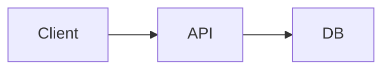

# Architecture overview

Đủ để V3 đánh giá khả thi. Chi tiết nằm ở repo code: `[URL]`.

## Sơ đồ

## Thành phần
| Thành phần | Trách nhiệm | Repo/đường dẫn | Owner |
|---|---|---|---|

## Tích hợp ngoài
| Hệ thống | Mục đích | Giới hạn (→ `constraints.md`) |
|---|---|---|

## Dữ liệu
[Thực thể chính, nơi lưu, dữ liệu nhạy cảm]

## Giới hạn đã biết
→ `constraints.md`
